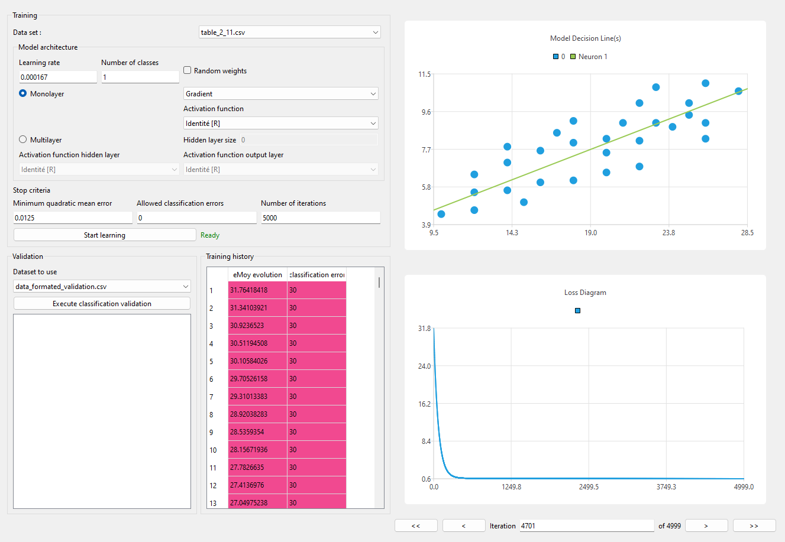

# Projet RNA - Exemples

## Perceptron - Neurone seul

### Operateur logique ET (2.1 / 2.3)

#### 1. Perceptron binaire

DataSet : 2.1
Learning Rate : 1
Nb classe : 2
Monolayer - Simple / Marche {0,1}

#### 2. Gradient/Adaline

DataSet : 2.1
Learning Rate : 0.5
Nb classe : 2
Monolayer - Gradient ou Adaline / Sigmoide [0,1]

### Données linéairement séparables (2.9)

#### Gradient

#### Adaline

### Classification de données linéairement séparables (2.10)

#### Gradient

#### Adaline

### Classification de données non linéairement séparables (2.11)

#### Gradient

#### Adaline

## Perceptron monocouche - +eurs neurones

### Classification à 3 classes (3.1)

#### Gradient

#### Adaline

### Classification à 4 classes (3.5)

#### Adaline

#### Gradient

## Perceptron multicouche

### XOR 

TODO

### Classification à 2 classes non linéairement séparables  (4.12)

TODO

### Classification à 3 classes non linéairement séparables  (4.14)

TODO

### Régression non-linéaire (4.17)

TODO